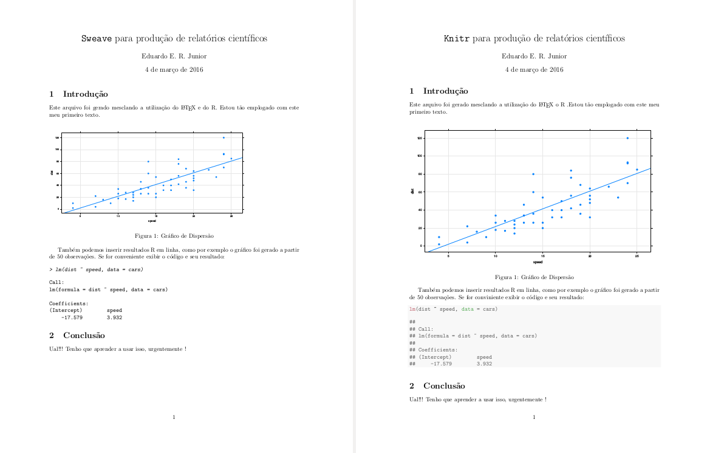

% Relatórios Dinâmicos em R: Sweave vs knitr
% Eduardo Junior
% 2016-03-04

Não é de hoje que o sonho dos estudantes e pesquisadores, principalmente
de ciências exatas, é elaborar relatórios científicos (artigos,
trabalhos acadêmicos, apresentações, etc.) de forma fácil e
elegante. Para nós da Estatística o sonho fica ainda melhor se
combinarmos os *outputs* do R, linguagem de programação padrão na área,
com nosso documento final (porque ninguém merece ficar exportando
gráficos e tabelas e colando em outro aplicativo). O sonho já é
realidade com `utils::Sweave` [Friedrich Leisch] e `knitr::knit`
[Yihui Xie], principais funções do próprio R, que combinam as
funcionalidades do R com a elegância do LaTeX tudo elaborado em um único
documento.

Para o R o precursor da facilidade de escrita LaTeX mesclada a códigos R
foi o `Sweave`, proposto primeiramente para S-Plus no início do século
XXI. Com ele podemos escrever um documento utilizando as marcações LaTeX
e inserindo códigos R (ou S-Plus) no meio do texto com a devida
identificação, a qual chamamos de `chunks`. Tudo isso deve ser feito em
um arquivo com extensão `.Rnw` (ou `.Snw` para códigos S-Plus) e
posteriormente interpretado pela função `Sweave("file.Rnw")` que gera um
arquivo LaTeX que, após compilado, resulta em um arquivo PDF com uma
qualidade incrível. Veja como é fácil usar o Sweave:

 1. Em um arquivo `myfile.Rnw` salve o conteúdo
 
```

\documentclass{article}         %% Classe do documento
\usepackage[brazil]{babel} 	    %% Idioma
\usepackage[utf8x]{inputenc} 	%% Codificacao de caracteres
\usepackage{float}              %% Posição das figuras

\title{\texttt{Sweave} para produção de relatórios científicos}
\author{Eduardo E. R. Junior}

\begin{document}

\maketitle

\section{Introdução}

Este arquivo foi gerado mesclando a utilização do \LaTeX\ e do R.  Estou
tão emplogado com este meu primeiro texto.

\begin{figure}[htb]
<<echo = false, fig = true, width = 12>>=
lattice::xyplot(dist ~ speed, pch = 19, grid = TRUE, 
                type = c("p", "r"), data = cars)
@ 
\caption{Gráfico de Dispersão}
\end{figure}

Também podemos inserir resultados R em linha, como por exemplo o gráfico
foi gerado a partir de \Sexpr{nrow(cars)} observações. Se for
conveniente exibir o código e seu resultado:

<<echo=true>>=
lm(dist ~ speed, data = cars)
@ 

\section{Conclusão}

Ual!!! Tenho que aprender a usar isso, urgentemente !

\end{document}

```

2. Agora compile o arquivo para gerar o PDF

```{r, echo = TRUE, eval = FALSE}

## Gera o arquivo .tex
utils::Sweave("myfile.Rnw", encoding="utf-8")

## Gera o arquivo .pdf
tools::texi2pdf("myfile.tex")

```

E assim como nesse simples exemplo, seguiu (e ainda se segue) a produção
científica Estatística. Mas a falta de flexibilidade do `Sweave` e a
demanda de pesquisadores fez com que surgissem diversos pacotes em R que
estendessem seu uso, desde permitir *cache memory* (`cacheSweave`) até a
exportação de relatórios HTML (`R2HTML`). Na tentativa, bem sucedida
aliás, de unificar as principais vertentes do `Sweave`, Yihui Xie em
2012 criou o pacote `knitr` que estende as opções fornecidas pelo
`Sweave`. Este novo pacote permite agora a customização no destaque de
código, formatação de figuras, memória em *cache*, compilação em
diferentes formatos (`Rnw ou Rtex -> .tex`; `.Rhtml -> .html`; `.Rmd ->
.md`; `.Rrst -> .rst`), entre outras novas funcionalidades.

O `knitr`, para acomodar as diversas customizações permitidas, teve uma
ligeira mudança na sintaxe das opções dos *chunks*. Algumas das mais
evidentes mudanças são a capitalização dos argumentos lógicos, de `true`
para `TRUE` e de `false` para `FALSE` e o abandono da opção `fig`, o
`knitr` já inclui figuras sem a necessidade de especificar no *chunk*
que se trata de uma saída gráfica. Escrevendo o mesmo documento exemplo,
agora com a sintaxe `knitr` temos:

1. No arquivo `myfile2.Rnw`, o conteúdo fica

```

\documentclass{article}         %% Classe do documento
\usepackage[brazil]{babel} 	    %% Idioma
\usepackage[utf8x]{inputenc} 	%% Codificacao de caracteres
\usepackage{float}              %% Posição das figuras

\title{\texttt{Sweave} para produção de relatórios científicos}
\author{Eduardo E. R. Junior}

\begin{document}

\maketitle

\section{Introdução}

Este arquivo foi gerado mesclando a utilização do \LaTeX\ do R .Estou
tão emplogado com este meu primeiro texto.

<<echo=FALSE, fig.cap = "Gráfico de Dispersão", fig.pos = "htb", fig.width = 12>>=
lattice::xyplot(dist ~ speed, pch = 19, grid = TRUE, 
                type = c("p", "r"), data = cars)
@ 

Também podemos inserir resultados R em linha, como por exemplo o gráfico
foi gerado a partir de \Sexpr{nrow(cars)} observações. Se for
conveniente exibir o código e seu resultado:

<<echo=TRUE>>=
lm(dist ~ speed, data = cars)
@ 

\section{Conclusão}

Ual!!! Tenho que aprender a usar isso, urgentemente !

\end{document}

```

2. Agora compile o arquivo para gerar o PDF
```{r, echo = TRUE, eval = FALSE}

## Gera o arquivo .tex
knitr::knit("myfile2.Rnw")

## Gera o arquivo .pdf
tools::texi2pdf("myfile2.tex")

```

Os relatórios resultantes são apresentados lado a lado na figura
abaixo. Note que não há muita diferença entre o `Sweave` e o `knitr`
apenas na formatação da saída de código R. Porém isso se deve ao fato de
não nos empenharmos na customização, ou seja, estamos utilizando o
padrão de cada uma.




Neste pequeno exemplo a migração de sintaxe foi trivial, mas pense que
estivéssemos escrevendo um livro com `Sweave` e desejasse migrar para o
`knitr`. De forma manual certamente daria um imenso trabalho, felizmente
o Yihui pensou nisso também e se você já escreve ou escreveu documentos
utilizando o `Sweave` a transição para o `knitr` pode ser realizada
através da função `knitr::Sweave2knitr()`. No nosso exemplo:

```{r, echo = TRUE, eval = FALSE}

## Gera o arquivo .Rnw com a sintaxe knitr
knitr::Sweave2knitr("myfile.Rnw")

## Gera o arquivo .tex
knitr::knit("myfile-knitr.Rnw")

## Gera o arquivo .pdf
tools::texi2pdf("myfile-knitr.tex")

```

Assim se você está escrevendo ou já escreveu algo que deseja ver o
resultado utilizando o `knitr` você pode fazê-lo de forma muito simples.

Enfim, com estas duas ferramentas escrever textos científicos fica muito
mais fácil. Todos estes esforços são para facilitar a produção
científica, fazendo com que o pesquisador demande o seu tempo na
produção de conhecimento e não em formatação e mesclagem manual de
saídas de diversos programas.

